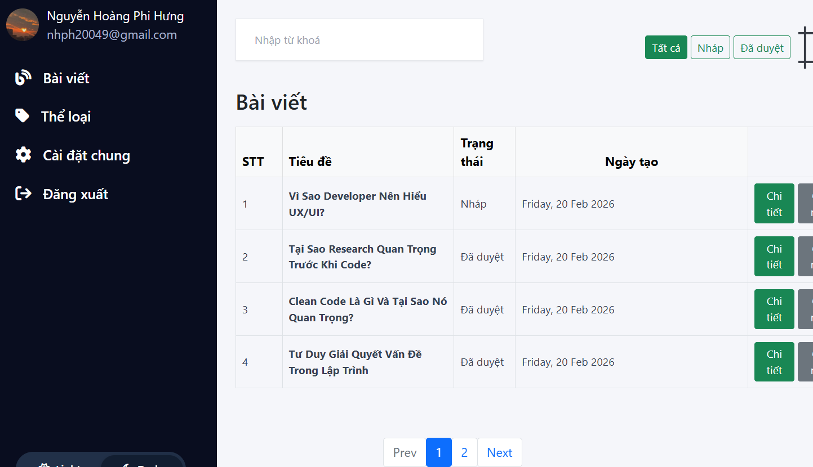

# 🚀 Blog

Một nền tảng blog được xây dựng bằng **NodeJS, Express và MongoDB**, cho phép quản lý bài viết, tag và hệ thống quản trị admin.

Project được phát triển theo mô hình **MVC**, tối ưu cho khả năng mở rộng và bảo trì.

---

## 📌 Demo

Chạy local tại:

http://localhost:3000

Admin:

http://localhost:3000/admin

---

## 🛠 Tech Stack

- NodeJS
- ExpressJS
- MongoDB
- Mongoose
- EJS
- Bootstrap 5
- TinyMCE
- Express Session
- BcryptJS

---

## ✨ Features

### 🔐 Authentication
- Đăng nhập Admin
- Xác thực bằng session
- Bảo mật mật khẩu bằng bcrypt

### 📝 Blog Management
- CRUD bài viết
- Trạng thái: Draft / Published
- Soạn thảo nội dung bằng TinyMCE
- Format ngày tháng

### 🏷 Tag Management
- CRUD tag
- Màu sắc tag tùy chỉnh
- Liên kết tag với bài viết

### 🎨 UI
- Responsive
- Bootstrap 5
- Toggle Dark / Light Mode

---

## ⚙ Installation

### 1️⃣ Clone project

```bash
git clone https://github.com/hunghoangphi2004/blog.git
cd blog
```

### 2️⃣ Cài đặt dependencies

```bash
npm install
```

### 3️⃣ Tạo file `.env` ở thư mục gốc

```env
PORT=3000
MONGO_URL=YOUR_MONGO_URL
CLOUD_NAME=YOUR_CLOUD_NAME
CLOUD_KEY=YOUR_CLOUD_KEY
CLOUD_SECRET=YOUR_CLOUD_SECRET
```

### 4️⃣ Chạy project

```bash
npm start
```

---

## 🖼 Screenshots

### Homepage
<p align="center">
  
</p>

### Admin Dashboard
<p align="center">
  
</p>

---

## 📂 Project Structure

```
blog/
│
├── config/
├── controllers/
├── models/
├── routes/
├── views/
├── public/
├── helpers/
├── middlewares/
├── .env
├── app.js
└── package.json
```

---

## 📜 License

This project is for learning and development purposes.